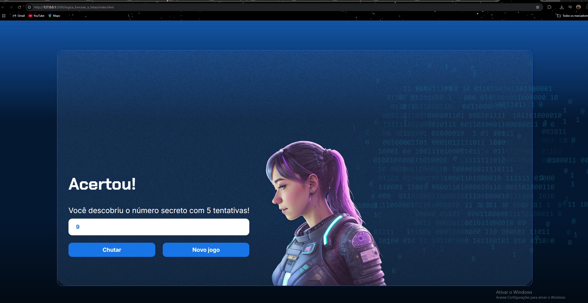

# Projetos_oracle

# Projeto Amigo Secreto

Este projeto é uma evolução do clássico jogo do **Número Secreto**, agora com uso de **funções, listas** e a implementação da **síntese de voz (speech synthesis)**, tornando a experiência mais interativa e acessível.

---

## **Funcionalidades**

Geração automática de um número secreto aleatório.
-  Armazena tentativas em uma lista para controle.
-  Validação de entrada para impedir campos vazios ou inválidos.
-  Respostas **faladas** usando a API de síntese de voz do navegador (speechSynthesis).
-  Informa se o número é **maior** ou **menor** que o número secreto.
-  Exibe e **fala** uma mensagem de sucesso quando o número é descoberto.
-  Reinício automático após vitória.
---

## **Como usar**

1. Clone ou baixe este repositório.  
2. Abra o arquivo `index.html` em seu navegador.  
3. Digite um número, ou use as setas, e pressione Enter ou clique em “Chutar”.
4. Ouça as dicas e siga tentando até acertar o número.
5. Ao vencer, o jogo será reiniciado automaticamente.
---

## **Tecnologias usadas**

- HTML
- JavaScript (puro)
- CSS
- Web Speech API  (window.speechSynthesis)

---

## **Destaques Técnicos** 
- Uso de funções puras para modularizar a lógica.
- Utilização de listas (arrays) para armazenar os chutes.
- Implementação de acessibilidade auditiva com voz falada em português.
- Manipulação do DOM de forma dinâmica.

---

## **Demonstração**

---

## **Autor**

Desenvolvido por [Kethelen_de_Azevedo].  
📧 kethelenfernandes13@gmail.com  
🔗 [LinkedIn](https://www.linkedin.com/in/kethelendeazevedo)

---

## **Licença**

Este projeto é de uso livre para estudos! 🎉
