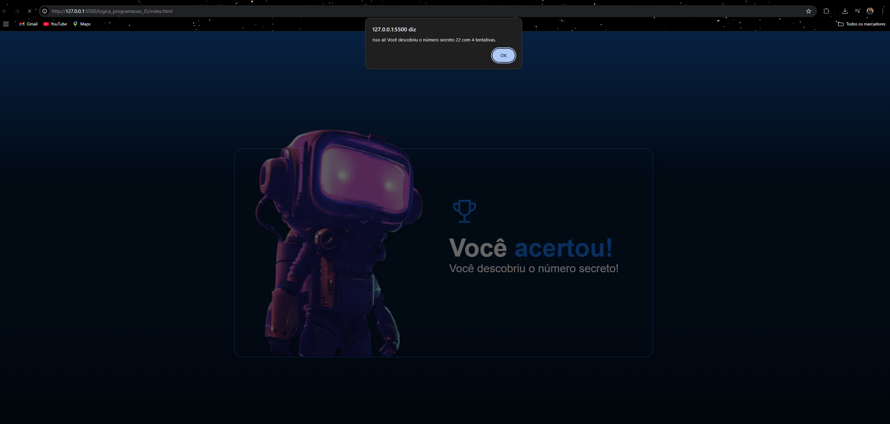

# Projetos_oracle

# Projeto Número Secreto

Este é um projeto simples de **Número Secreto**, feito em HTML, CSS e JavaScript puro, no qual o jogador precisa adivinhar um número secreto gerado aleatoriamente pelo sistema.

---

## **Funcionalidades**

-  Geração automática de um número secreto aleatório.
-  Validação de entrada para evitar campos vazios ou inválidos.
-  Atualização em tempo real das tentativas.
-  Indicação se o número digitado é **maior** ou **menor** que o número secreto.
-  Mensagem de sucesso ao acertar, com contagem de tentativas.
-  Reinício automático do jogo após o acerto.

---

## **Como usar**

1. Clone ou baixe este repositório.  
2. Abra o arquivo `index.html` em seu navegador.  
3. Digite um número e tente adivinhar o número secreto
4. O sistema informará se o número digitado é maior ou menor 
5. Ao acertar, o jogo exibirá a mensagem de sucesso e reiniciará após um clique em **OK** para recomeçar.

---

## **Tecnologias usadas**

- HTML
- JavaScript (puro)
- CSS
---

## **Demonstração**

---

## **Autor**

Desenvolvido por [Kethelen_de_Azevedo].  
📧 kethelenfernandes13@gmail.com  
🔗 [LinkedIn](https://www.linkedin.com/in/kethelendeazevedo)

---

## **Licença**

Este projeto é de uso livre para estudos! 🎉
